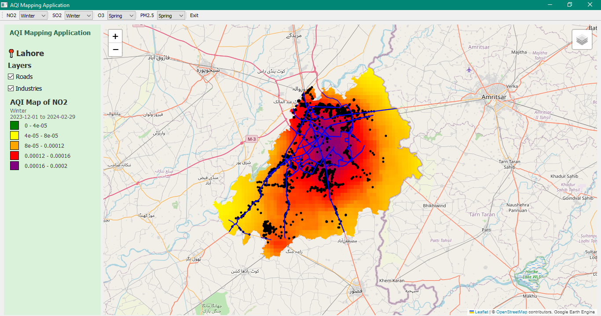

# Seasonal AQI Mapping Application (2024)

An interactive desktop application for visualizing and analyzing seasonal air quality data across **Lahore, Pakistan** for the year 2024. The app combines satellite-derived pollutant data from Google Earth Engine with local geospatial layers stored in a PostGIS database, presented through a clean PyQt5 desktop interface.

> Built as an academic project for the *Advanced Geodatabase & Programming* course at the Institute of Geographic Information System (IGIS), National University of Sciences & Technology (NUST).


*NO₂ concentration map for Lahore (Winter 2024), with road network, industrial points, and the auto-generated legend.*

## Overview

The application lets users explore four key air pollutants across the four seasons of 2024, rendering satellite pollutant concentrations as color-coded map overlays with a dynamic legend. Users can also toggle local infrastructure layers, overlaying road networks and industrial points on the pollutant maps.

## Features

- **Seasonal pollutant mapping** — Visualize NO₂, SO₂, O₃, and PM2.5 for Spring, Summer, Autumn, and Winter 2024.
- **Satellite data integration** — Pollutant concentrations are pulled live from the Copernicus Sentinel-5P datasets via the Google Earth Engine API and clipped to the Lahore boundary.
- **Dynamic legend** — A color-coded legend generates automatically for the selected pollutant and season, showing concentration thresholds, and clears itself when the selection changes.
- **Toggleable local layers** — Show or hide road networks and industrial points loaded from a PostGIS database.
- **Interactive map** — Built with Folium and embedded in the desktop app, with pan, zoom, and layer controls.

## Tech Stack

| Purpose | Technology |
|---|---|
| Language | Python |
| GUI | PyQt5 |
| Interactive maps | Folium |
| Satellite data | Google Earth Engine (`ee`), geemap |
| Geospatial processing | GeoPandas |
| Database | PostgreSQL + PostGIS, via SQLAlchemy |

## Prerequisites

- Python 3.9+
- A [Google Earth Engine](https://earthengine.google.com/) account and an initialized EE project
- A PostgreSQL database with the PostGIS extension enabled, containing:
  - `lahore_road_network` — road network geometries
  - `lahore_industry_points` — industrial point locations
- A shapefile of the Lahore administrative boundary

## Installation

1. **Clone the repository**
   ```bash
   git clone https://github.com/YOUR-USERNAME/aqi-mapping-application.git
   cd aqi-mapping-application
   ```

2. **Install dependencies**
   ```bash
   pip install PyQt5 PyQtWebEngine folium earthengine-api geemap geopandas sqlalchemy psycopg
   ```

3. **Authenticate Google Earth Engine** (first run only)
   ```bash
   earthengine authenticate
   ```
   Then update the Earth Engine project ID in the code to your own project.

4. **Set your database password** as an environment variable (the app reads it from `DB_PASSWORD` so no credentials are stored in the code):

   Windows (PowerShell):
   ```powershell
   setx DB_PASSWORD "your_password_here"
   ```
   macOS / Linux:
   ```bash
   export DB_PASSWORD="your_password_here"
   ```

5. **Update file paths** — The Lahore boundary shapefile path is set in the code. Update it to point to your local copy of the shapefile.

## Usage

Run the application:
```bash
python AQIapplication.py
```

Then:
- Use the **toolbar** to pick a pollutant (NO₂, SO₂, O₃, PM2.5) and a season for each.
- Use the **side panel** checkboxes to toggle the Roads and Industries layers.
- The **legend** on the left updates automatically to match the pollutant and season currently displayed.

## Notes

- The application generates temporary HTML map files at runtime (e.g. `map.html`, `NO2_map.html`); these are excluded from the repository via `.gitignore`.
- Database credentials are never committed — they are read from the `DB_PASSWORD` environment variable.

## Project Context & Team

This was a group project for the *Advanced Geodatabase & Programming* course at IGIS, NUST, supervised by **Dr. Ali Tahir**.

**Team**
- **Zainab Javaid** — Team Lead
- Sadia Saleem
- Kashf Ali
- Muhammad Yaqoob